# Pipeline stages — reference for finalization (v4.0)

This document is the **canonical stage map** for the agri-credit pipeline. Use it when optimizing code, configs, or wiring new features (including AI) **stage by stage**.

**Production path:** one orchestrator — continuous Sentinel-2, crop cycles, `AdvancedCreditScorer`. There is no alternate “basic” mode in `main.py`.

---

## Architecture snapshot

```mermaid
flowchart LR
  subgraph ingest [Ingest]
    S0[Stage 0 DB]
    S1[Stage 1 Shell]
    S2[Stage 2 Satellite]
  end
  subgraph core [Core analysis]
    S3[Stage 3 Analysers]
    S4[Stage 4 Cycles]
    S5[Stage 5 Crops ML]
    S6[Stage 6 Weather]
    S7[Stage 7 Performance]
  end
  subgraph score [Score and deliver]
    S8[Stage 8 Credit]
    S9[Stage 9 Limit]
    S10[Stage 10 Payload]
    S11[Stage 11 DB]
  end
  S0 --> S1 --> S2 --> S3 --> S4 --> S5 --> S6 --> S7 --> S8 --> S9 --> S10 --> S11
```

**Optional (not invoked inside `assess_farmer` today):** `ai_integration/*` — Groq reports, Sarvam translation, SHAP, counterfactuals. Config lives in `PipelineConfig.AI_CONFIG`; wire these as **Stage 12+** or a separate API when you finalize the product.

---

## Constructor options (`SatelliteBasedCreditPipeline.__init__`)

| Parameter | Effect |
|-----------|--------|
| `crop_model_path` | Joblib crop classifier used in Stage 5. |
| `ml_mode` | `rule_based` \| `unsupervised` \| `supervised` \| `hybrid` — passed to `AdvancedCreditScorer`. |
| `verbose` | Extra logging from the pipeline shell. |
| `use_mongodb` | If true and `mongodb_helper` is available, Stage 0 / 11 use MongoDB. |

Assessment metadata includes `pipeline_profile: "continuous_v4"` (fixed).

---

## Stage 0 — Farm context (MongoDB entry path)

**Entry:** `assess_farmer_from_db(farmer_id)`  
**Code:** `main.py` → `MongoDBHelper.get_farm_by_id`

| Step | What happens |
|------|----------------|
| 0.1 | Normalize `farmer_id` (strip whitespace); reject empty id with a failed result dict. |
| 0.2 | Load `farm_info` document (`farmer_id`, optional `latitude`, `longitude`, `field_area_ha`, `geometry`, `crop`, `sowing_date`, `farmer_benefits`, …). |
| 0.3 | Normalize `geometry` via `_convert_geometry_from_db` (GeoJSON dict, vertex list, or Shapely). Invalid/missing → downstream uses **point + `field_area_ha`**. |
| 0.4 | Call `assess_farmer(..., save_to_db=True)` with extracted fields. |

**Config / files:** `mongodb_helper.py` (collections, indexes, `AssessmentSchema` for writes — used again in Stage 11).

---

## Stage 1 — Assessment shell

**Entry:** start of `assess_farmer` (after `farmer_id` validation)  
**Code:** `main.py`

| Step | What happens |
|------|----------------|
| 1.1 | Require non-empty `farmer_id`; normalize `crop_hint` / `sowing_date` (strip strings). |
| 1.2 | Build `assessment` dict: `pipeline_version`, `pipeline_profile`, `ml_mode`, `pipeline_stages` (starts with `1_shell`), hints, `warnings`, `errors`. |
| 1.3 | Early failures (missing id, Mongo unavailable, farmer not found) use `_failed_assessment_shell` so metadata shape matches successful runs (`pipeline_version`, `assessment_date`, `processing_time_seconds`, etc.). |

`pipeline_stages` grows through the run: `2_satellite`, `3_analysers`, `4_cycles`, `5_crops`, `6_weather`, `7_performance`, `8_credit`, `9_limit`, `10_payload`, optional `12_ai` when Groq/Sarvam enrichment runs, and `11_persist` if Mongo save succeeds. A failed run keeps the list **prefix** up to the last completed step.

---

## Stage 2 — Continuous satellite time series

**Entry:** `STEP 1` log in `main.py`  
**Code:** `data_acquisition/satellite_collector.py` → `collect_historical_data()` → `_collect_continuous_approach`

| Step | What happens |
|------|----------------|
| 2.1 | **Geometry:** bbox from polygon or point+area (`utils/geometry_utils.py`). |
| 2.2 | **Window:** rolling ~3 years to today; start snapped to the latest agricultural anchor on or before `today − 3×365d` — **15 June** (Kharif) or **15 October** (Rabi). |
| 2.3 | **STAC:** Sentinel-2 L2A; queries often split by calendar year. Cloud filter uses **Jun–Oct → Kharif cap** (monsoon tail), else **Rabi cap** (segment midpoint). |
| 2.4 | **Dedupe:** one item per calendar day (lowest cloud). |
| 2.5 | **Grid:** fixed `CONTINUOUS_SCENE_INTERVAL_DAYS` bins (default 10); per bin pick lowest-cloud scene whose acquisition falls in the bin, or emit a **placeholder** (`missing: true`, NaN indices). Series `date` = **bin start**; real acquisitions may set `acquisition_date`. |
| 2.6 | **Download:** one scene at a time (stable COG reads); optional parallel **band** reads per scene. |
| 2.7 | **Output:** `continuous_data` with aligned `dates`, index arrays, `interval_days`, `valid_observations` / `missing_observations`. Gaps are imputed in Stage 4. |

**Primary config:** `CONTINUOUS_SCENE_INTERVAL_DAYS`, `SATELLITE_*`, `SENTINEL2_BANDS`, STAC URL/collection.

---

## Stage 3 — Location-bound analysers

**Code:** `main.py` (immediately after satellite validation)

| Step | What happens |
|------|----------------|
| 3.1 | `WeatherAnalyzer(latitude, longitude, interval_days=continuous_data['interval_days'])` using **satellite centroid**; `interval_days` aligns spell-length rules with the Sentinel grid (see Stage 6). |
| 3.2 | `CropDetector(crop_model_path, latitude, longitude)` for cycle-wise ML classification. |
| 3.3 | `pipeline_stages` records `3_analysers` after both are constructed. |

---

## Stage 4 — Crop cycles and land use

**Entry:** `STEP 2` log  
**Code:** `crop_analysis/crop_cycle_detector.py`, `crop_analysis/land_utilization_analyzer.py`

| Step | What happens |
|------|----------------|
| 4.1 | **Inputs:** `dates`, NDVI/EVI/NDMI (+ raw `scenes`); optional DB `sowing_date` / `crop_hint` for extra greenup anchors. |
| 4.2 | **Preprocess:** cloud-gap flags on raw dates; **grid step = satellite `interval_days`** (default 10d); edge extrapolation by slope; chronological imputation (short = linear; long = context-aware hat when post-gap decline). |
| 4.3 | **CVI** + smooth; **greenup** candidates; **sowing** refined as first stable NDVI rise from low baseline (transplant path: EVI+NDMI); **harvest** as post-peak decline → below low NDVI → stabilize/min (with rapid CVI / NDMI cues); validate; merge duplicate overlaps only. |
| 4.4 | **Land use:** crops/year, utilization index, pattern labels, fallow/duration stats from `CropCycle` objects. |

**Output in `assessment`:** later `crop_cycles` block + metrics passed into scoring.  
**Primary config:** `CROP_CYCLE_*`, `CYCLE_IMPUTE_*`, `CYCLE_GRID_STEP_DAYS`, … in `config.py`.

---

## Stage 5 — Per-cycle cultivation + crop classifier (ML)

**Entry:** `STEP 3` log  
**Code:** `crop_analysis/crop_detector.py` → `analyze_cycles`

| Step | What happens |
|------|----------------|
| 5.1 | For each Stage-4 cycle, **reported** `start_date` / `end_date` = sowing → final harvest; **scene gather** uses that window ± `CROP_DETECTOR_CYCLE_SCENE_PADDING_DAYS` (real scenes only, no placeholders). |
| 5.2 | **Temporal rules** with `cycle_based=True` (relaxed vs raw seasons — cycle already validated in Stage 4). |
| 5.3 | If cultivated: **cultivation_signal** + **RandomForest** (joblib) on interpolated time features → predicted crop + confidence. |
| 5.4 | Each `season_result` carries Stage-4 context: `peak_date`, `harvest_start_date`, `harvest_end_date`, `season_label`, `baseline_ndvi`, gap flags, etc. |

**Output:** `cropping_analysis` (`season_results`, summaries, `crops_detected`, intensity, …).  
**Config:** `MIN_*`, `ML_FEATURE_*`, `CROP_DETECTOR_CYCLE_SCENE_PADDING_DAYS`, model path from pipeline init.

---

## Stage 6 — Cycle-aligned weather

**Entry:** `STEP 4` log  
**Code:** `data_acquisition/weather_analyzer.py` → `analyze_cycle_weather`

| Step | What happens |
|------|----------------|
| 6.1 | For each cycle with cultivation, fetch **NASA POWER** daily series for the cycle window. |
| 6.2 | **Dynamic thresholds** (default `WEATHER_USE_DYNAMIC_THRESHOLDS`): per-cycle percentiles from that window for heat/cold/rain/dry-day cutoffs; minimum spell lengths scale with **satellite `interval_days`**; static constants are fallbacks when disabled or the series is short. |
| 6.3 | Detect extremes; map to **growth-stage fractions**; attach `weather_thresholds_used` / `weather_threshold_mode` per cycle; build narratives and **risk scores**. |

**Output:** `weather_analysis` (events, `weather_risk_score`, cycle-level stats, `interval_days`).  
**Config:** `WEATHER_*`, `NASA_POWER_*`, `weather_analyzer` + `PipelineConfig`.

---

## Stage 7 — Per-cycle performance

**Entry:** `STEP 5` log  
**Code:** `crop_analysis/performance_analyzer.py` → `analyze_performance`

| Step | What happens |
|------|----------------|
| 7.1 | **Dual path:** crop-specific curves when classification is reliable; else **enhanced** crop-agnostic health/yield. |
| 7.2 | Anomaly / trajectory signals attached for scoring (`anomaly_events`, …). |

**Output:** `performance_analysis` (per-cycle scores, aggregates, `n_complete_cycles`, …).

---

## Stage 8 — Credit score

**Entry:** `STEP 6` log  
**Code:** `assessment/advanced_credit_scorer.py` (or `credit_scorer.py` if advanced off)

| Step | What happens |
|------|----------------|
| 8.1 | **Rule-based block:** weighted components (crop detection, performance, yield proxy, weather safety, anomaly penalty, cropping intensity, govt benefits). |
| 8.2 | **Unsupervised (hybrid):** `UnsupervisedFarmerSegmentation` / isolation-style signals on engineered features when mode includes it. |
| 8.3 | **Supervised:** optional XGBoost/RF path when labels/model available (mode-dependent). |
| 8.4 | **Blend:** e.g. hybrid = rule × 0.65 + unsupervised × 0.35 (see scorer code). |

**Output:** `credit_assessment` (`credit_score`, `risk_category`, `component_scores`, `method`, `weak_components`, …).

---

## Stage 9 — Credit limit and recommendations

**Entry:** `STEP 7` log (first part)  
**Code:** same scorer class → `calculate_credit_limit`

| Step | What happens |
|------|----------------|
| 9.1 | Map score + area + cropping/performance context → **recommended limit**, rate hints, explanation text. |

**Output:** `credit_recommendations`.

---

## Stage 10 — Final payload and summary

**Code:** `main.py`

| Step | What happens |
|------|----------------|
| 10.1 | Attach `crop_cycles` (dicts from `CropCycle.to_dict()`), `continuous_data_stats`, all analysis blocks. |
| 10.2 | `processing_time_seconds`, `status='SUCCESS'`, `_generate_summary()` compact JSON-friendly summary. |

---

## Stage 11 — Persistence

**Entry:** `save_to_db` and Mongo enabled  
**Code:** `mongodb_helper.py` → `save_assessment`

| Step | What happens |
|------|----------------|
| 11.1 | `AssessmentSchema` maps raw `assessment` → bounded document (no large rasters). |
| 11.2 | Insert into `credit_assessments` (indexes from `_ensure_indexes`). |

**Note:** MongoDB save is logged as **STEP 11**.

---

## Optional Stage 12 — AI enrichment (wired in `assess_farmer`)

**Code:** `ai_integration/enrichment.py` → `enrich_assessment_with_ai(assessment)`  
**When:** After Stage **10** payload; adds `pipeline_stages` entry `12_ai` only if something was written.

| Module | Role | Activation |
|--------|------|------------|
| `groq_report_generator.py` | English narrative from assessment JSON. | `GROQ_API_KEY` → `AI_CONFIG["groq"]["enabled"]`. |
| `sarvam_translator.py` | Translate narrative (default Hindi). | `SARVAM_API_KEY` → `AI_CONFIG["sarvam"]["enabled"]` (runs after Groq text exists). |

**Output:** `assessment['ai_enrichment']` with `english_narrative`, optional `translated_narrative` / `translation_language`. MongoDB stores **truncated previews** in `ai_enrichment` on the saved document (see `AssessmentSchema`).

**Stage 12+ (not auto-run):** `shap_explainer.py`, `counterfactual_engine.py` — call from a separate CLI/API entrypoint when you attach model handles and flags.

---

## Config ownership (quick map)

| Area | `config.py` sections |
|------|---------------------|
| Satellite / STAC / bands / download | `SENTINEL2_*`, `CONTINUOUS_*`, `SATELLITE_*` |
| Cycle detection + grid imputation | `CROP_CYCLE_*`, `CYCLE_IMPUTE_*`, `CYCLE_GRID_STEP_DAYS` |
| Crop temporal + ML features | `MIN_NDVI_*`, `ML_FEATURE_*`, crop lists / curves |
| Weather | `WEATHER_*`, NASA POWER |
| Credit weights (basic config class) | `CREDIT_WEIGHTS`, limits, risk bands |
| AI | `AI_CONFIG` (env-driven keys) |

---

## `main.py` log labels vs this document

| Log | Stages covered |
|-----|----------------|
| STEP 1 | Stages **2–3** (collect + bind analysers) |
| STEP 2 | Stage **4** |
| STEP 3 | Stage **5** |
| STEP 4 | Stage **6** |
| STEP 5 | Stage **7** |
| STEP 6 | Stage **8** |
| STEP 7 (limit) | Stage **9** |
| STEP 8 (cycles dict) | Stage **10**; optional **12** (AI) immediately after |
| STEP 11 | Stage **11** (MongoDB save) |

---

## Suggested next cleanups (alignment with this doc)

1. ~~Wire **Stage 12** AI enrichment~~ — done via `enrich_assessment_with_ai` + `12_ai` stage.  
2. Trim unused seasonal / legacy helpers inside collectors and weather if you no longer call them.  
3. Optional: CLI flag to force-disable AI calls even when API keys are present.

---

*Aligned with `main.py` v4.0 continuous `assess_farmer` flow and repository layout as of the pipeline finalization pass.*
