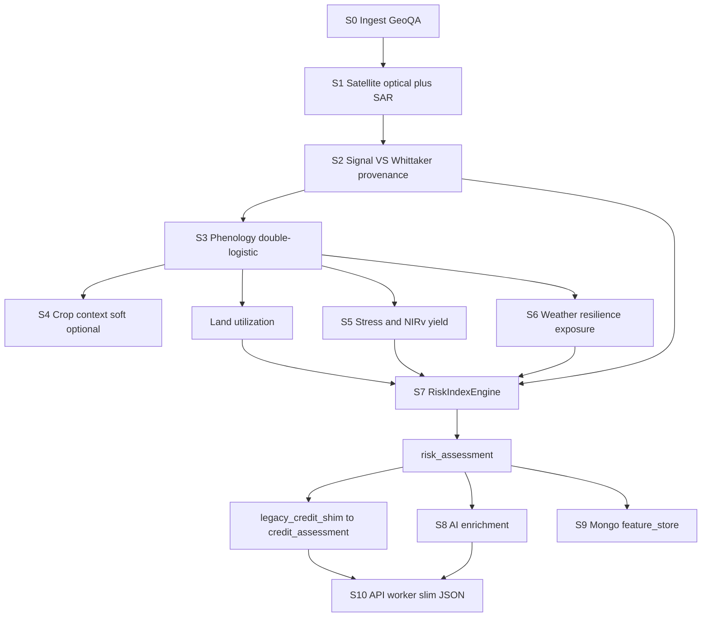

# Backend Enhancements — index_v5 (Agronomic Risk Index)

**Audience:** backend maintainers **and** frontend engineers integrating dashboards / reports.  
**Package root:** `backend/Credit_assessment/`  
**Contract docs:** `BACKEND-ARCHITECTURE-v5.md`, `INTEGRATION-AND-STATUS.md`  
**Pipeline version:** `5.0` · **Index version:** `index_v5` · **Profile:** `index_v5`

This document describes what the enhanced backend does stage-by-stage: methods, weights, calculations, input/output schemas, report/enrichment shapes, known gaps, and how the frontend should consume the new payload.

---

## 1. What changed (enhancement summary)

| Area | Before (v4) | After (v5 / index_v5) |
|------|-------------|------------------------|
| Primary score | `AdvancedCreditScorer` (7 components) | `RiskIndexEngine` (4 weighted sub-indices + data-confidence **gate**) |
| Loan ₹ limit | `calculate_credit_limit` → `credit_recommendations` | **Removed** (agronomic risk index only; no repayment PD yet) |
| Dashboard compat | Native `credit_assessment` | Thin **shim** maps `risk_assessment` → `credit_assessment` (scalar bars) |
| Config | Scattered `config_pillar*_additions.py` | Single [`config.py`](config.py) (`PipelineConfig`) |
| Seasons | Kharif + Rabi anchors | Kharif / Rabi / **Zaid** snap anchors `(6,15),(10,15),(2,15)` |
| Signal | Optical NDVI-centric | Multi-index + **Whittaker** smooth + optional **SAR fusion** + Cloud Score+ |
| Phenology | Threshold / greenup heuristics | **Double-logistic** fit + monsoon cloud-gap inference + long-duration branch |
| Yield | NDVI-heavy | **NIRv-AUC** potential + peer percentile (when cohort warm) |
| Weather | Risk score from POWER | Resilience + forward exposure + SPI/SPEI/GDD hooks; POWER primary |
| Benefits | Often coerced `False` | **Tri-state** `None` / `True` / `False` end-to-end |
| Persistence | Slim credit fields | + `risk_assessment`, `index_version`, `feature_store` snapshots |

---

## 2. End-to-end data flow



**Banker's 5 Cs → sub-indices**

| Banker's C | Sub-index | Role in index |
|------------|-----------|---------------|
| Capacity | Land-Use & Activity | Additive weight **30** |
| Capacity / Character | Vigor & Yield-Potential | Additive weight **25** |
| Character | Stability & Stress | Additive weight **20** |
| Conditions | Weather | Additive weight **25** |
| (meta) | Data-Confidence | **Multiplicative gate** (not additive) |

---

## 3. Pipeline stages (runtime `pipeline_stages[]`)

These strings appear on every assessment and on job `progress`.

| Stage id | Domain stage | Module(s) | What happens |
|----------|--------------|-----------|--------------|
| `1_shell` | S0 | `main.py` | Assessment shell: farmer_id, benefits, hints, `pipeline_profile=index_v5`, `index_version` |
| `2_satellite` | S1–S2 | `satellite_collector.py`, `utils/data_processing.py` | Continuous Sentinel-2 (± SAR), 10-day bins, VS composite, Whittaker, provenance |
| `3_analysers` | S0/S2 | `geometry_utils`, India geo context | Geospatial prep, eco-region / agro zone tags |
| `4_cycles` | S3 | `crop_cycle_detector.py`, `land_utilization_analyzer.py` | Phenology cycles + LUI / fallow / intensity |
| `5_crops` | S4 | `crop_detector.py` (optional) | Soft crop context / optional ML challenger; otherwise unclassified cycles |
| `6_weather` | S6 | `weather_analyzer.py` | Cycle-aligned weather, resilience, exposure, indicators |
| `7_performance` | S5 | `performance_analyzer.py`, `peer_benchmark.py` | Stage stress, NIRv-AUC potential, peer percentile |
| `8_risk_index` | S7 | `risk_index_engine.py`, `legacy_credit_shim.py` | Index 0–100 + shim `credit_assessment` |
| `9_payload` | — | `main.py` | Attach `crop_cycles` payload |
| `10_ai` | S8 | `ai_integration/*` | SHAP/drivers, counterfactuals, optional Groq/Sarvam |
| `11_persist` | S9 | `mongodb_helper.py` | Save assessment + feature snapshot |

Orchestration (S10): Mongo `jobs` + [`worker.py`](worker.py) / FastAPI [`api/app.py`](api/app.py) → [`api/job_runner.py`](api/job_runner.py). **No Prefect.**

---

## 4. Stage-by-stage methods & I/O

### 4.1 S0 — Ingest & Geo-QA

**Inputs**
- Farm record (Mongo `farms` / `farm_info`): `farmer_id`, lat/lon, `field_area_ha`, geometry, optional `crop_hint`, `sowing_date`, benefit flags
- Job/API overrides: `pm_kisan_enrolled`, `has_crop_insurance` as `Optional[bool]` (`None` = unknown)

**Methods**
- Geometry QA / area ratio checks (`geometry_utils`)
- Season-aware continuous window: snap lookback to nearest of Jun 15 / Oct 15 / **Feb 15**
- Eco-region / agro-climatic tagging (`india_geo_context`) → used for `cohort_key`

**Outputs (assessment keys)**
- `location`, `field_area_ha`, `geospatial_prep`, `farmer_benefits`, `crop_hint`, `sowing_date`
- `pipeline_version: "5.0"`, `pipeline_profile: "index_v5"`, `index_version: "index_v5"`

**Benefits tri-state (critical for UI + scoring)**

| Value | Meaning | Index effect |
|-------|---------|--------------|
| `null` / omitted | Unknown | Neutral (no bonus, **no penalty**) |
| `true` | Confirmed enrolled | +`BENEFITS_BONUS_PER_FLAG` (default 2), capped at `BENEFITS_BONUS_MAX` (4) |
| `false` | Confirmed absent | No bonus |

---

### 4.2 S1–S2 — Satellite acquisition & signal construction

**Modules:** `data_acquisition/satellite_collector.py`, `utils/data_processing.py`  
**Config:** `INDEX_SET_OPTICAL`, `SIGNAL_COMPOSITE_*`, `WHITTAKER_*`, `SAR_*`, `CLOUD_MASK_VERSION`, `CONTINUOUS_LOOKBACK_YEARS`

**Indices (optical)**  
`NDVI, EVI, NDMI, NDWI, PSRI, NDRE, MSAVI2, NIRv, LSWI, GCVI, kNDVI`

**Composite vegetation signal `VS` (concept)**
1. Build optical blend (default weights): `kNDVI 0.50 + EVI 0.30 + NDMI 0.20` (min-max normalized per design)
2. Quality weight from valid pixels / cloud / parcel size
3. Fuse with SAR RVI when optical quality is low (if `SAR_ENABLED`)
4. Smooth with **Whittaker** (λ=`WHITTAKER_LAMBDA`, order=`WHITTAKER_DIFF_ORDER`); Savitzky–Golay fallback
5. Stamp each bin: `signal_source ∈ {optical, fused, sar, imputed}`, `bin_quality`

**Key outputs under `satellite_data.continuous_data` / top-level**
- Time grid: `dates`, interval (`CONTINUOUS_SCENE_INTERVAL_DAYS` = 10)
- Series: `vs_smooth` / `VS_mean`, NIRv, LSWI, legacy NDVI/EVI/…
- `signal_quality_summary`: e.g. `valid_fraction`, `mean_bin_quality`, `sar_fallback_fraction`, series length
- Provenance / source counts

**Frontend use:** trend charts should prefer `vs_smooth` or NIRv over raw NDVI when present; show a “data quality” chip from `signal_quality_summary`.

---

### 4.3 S3 — Phenology engine

**Module:** `crop_analysis/crop_cycle_detector.py`  
**Config:** `PHENO_AMP_FRACTION` (0.20), `PHENO_FIT_MIN_R2`, pre/post monsoon gates, `LONG_DURATION_PAD_DAYS`, `LONG_DURATION_CROPS`

**Methods**
1. Fit **double-logistic** to smoothed VS in candidate windows
2. **SOS** = rise crossing `base + amp×0.20`; **POS** = fitted max; **EOS** = fall crossing
3. Kharif **cloud-gap inference** (pre-monsoon low + post-monsoon high → sowing in Jun–Aug gap; SAR flood signature can confirm paddy)
4. Seasons: **kharif / rabi / zaid**; long-duration crops get extended duration caps (sugarcane/banana family), not the short 195-day global split

**Cycle object fields (typical)**  
`sowing_date`, `harvest_date`, `peak_date`, `duration_days`, `season_type`, `phenology` (SOS/POS/EOS, fit R²), peak/base amplitude, confidence flags

**Land utilization** (`land_utilization_analyzer.py`)
- `crops_per_year`, `land_utilization_index`, `cropping_pattern`, `fallow_analysis.fallow_fraction`, diversity
- Wired into `cropping_analysis.fallow_fraction` / intensity before scoring so land-use sub-index can use them

**Frontend use:** cycle timeline / Gantt; phenology markers; fallow fraction badge.

---

### 4.4 S4 — Crop context (soft)

**Module:** `crop_analysis/crop_detector.py` (optional via `enable_crop_classification` / env)

**Design**
- Registry / hint crop = **soft prior** for phenology & peer cohort — not a hard dependency for scoring
- ML classifier remains **off-by-default challenger** (`models/crop_classifier_model.joblib`)
- Score is produced even with unknown crop (`crop-family = NA` in cohort key)

**Outputs**
- `cropping_analysis.season_results[]` (crop label, detection confidence, duration, …)
- `crop_intelligence_source` / classification notes when ML runs

---

### 4.5 S5 — Stress & yield-potential

**Modules:** `performance_analyzer.py`, `utils/peer_benchmark.py`  
**Config:** `STRESS_BASELINE_Z_*`, `WATER_STRESS_Z`, `PEER_BENCHMARK_*`

**Methods**
- Per-parcel, per-growth-stage baseline; z-score / fence anomalies; stage-weighted impact (flowering/grain-fill > vegetative)
- Water stress from LSWI/NDMI drops
- **Yield potential** = NIRv-AUC over cycle → `yield_potential_score` (0–100) + optional peer percentile
- Peer cohort key: `agro_zone × season × crop_family` (crop_family often `'NA'` until soft prior improves)

**Key outputs in `performance_analysis`**
```text
{
  average_performance_score, average_yield_score, average_health_score,
  n_complete_cycles, n_active_cycles,
  seasonal_performance: [{
    season, year, is_active_cycle,
    yield_potential_score, yield_detail: { peak_cvi, nirv_auc_mean, ... },
    anomaly_events: [{ type, impact: HIGH|MEDIUM|LOW, stage, date, ... }],
    peer_benchmarking?: { percentile, n, ... },
    stress_baseline?: { ... }
  }],
  peer_benchmarking?: { ... }
}
```

**Frontend use:** per-cycle yield/health cards; anomaly list with stage tags; peer percentile when `n ≥ PEER_BENCHMARK_MIN_COHORT_N` (20).

---

### 4.6 S6 — Weather engine

**Module:** `weather_analyzer.py`  
**Config:** `WEATHER_SOURCE_PRIORITY` (default `["power"]`), GDD/heat/cold/onset/resilience knobs; IMD/ERA5/CHIRPS optional (`imdlib` not required)

**Methods**
- Cycle-aligned indicators: dry/wet spells, GDD, heat/cold days, monsoon onset anomaly, SPI/SPEI hooks
- **Backward resilience:** vegetation held through adverse events → `backward_resilience.mean_resilience_score`
- **Forward exposure:** zone climate risk → `forward_exposure.exposure_score`
- Legacy-compatible `weather_risk_score` (higher = worse)

**Outputs in `weather_analysis`**
```text
{
  analysis_mode: "cycle_aligned_v5",
  weather_risk_score,
  backward_resilience: { mean_resilience_score, ... },
  forward_exposure: { exposure_score, ... },
  cycle_weather / seasonal_weather: [...],
  weather_indicators_present?: bool
}
```

**Frontend use:** dual gauges (resilience vs exposure); keep showing risk score; label data source when stamped.

---

### 4.7 S7 — Risk index construction (core)

**Module:** `assessment/risk_index_engine.py`  
**Shim:** `assessment/legacy_credit_shim.py`

#### Composite formula

```text
additive     = Σ (sub_i.score × weight_i / 100)     for i ∈ {landuse, vigor, stability, weather}
raw_index    = clip_0_100(additive + benefits_bonus)
index_score  = clip_0_100(raw_index × confidence_gate)
```

#### Weights (AHP provisional — expert sign-off pending)

| Key | Weight | Banker's C |
|-----|--------|------------|
| `landuse` | **30** | Capacity |
| `vigor` | **25** | Capacity / Character |
| `stability` | **20** | Character |
| `weather` | **25** | Conditions |
| `data_confidence` | gate only | meta |

Config: `PipelineConfig.SUBINDEX_WEIGHTS` (must sum ≈ 100). Engine renormalizes defensively.

#### Sub-index formulas (essentials)

**1. Land-use & activity**
```text
cycles_per_year = n_complete_cycles / years
intensity = piecewise ladder on cycles_per_year (0.5→35 … ≥2.0→100)
coverage  = seasons_with_crops / total_seasons × 100   (fallback from cpi)
fallow_penalty = clip(fallow_fraction × 100, 0, 40)
score = 0.55×intensity + 0.30×coverage + 0.15×(100 − fallow_penalty)
```

**2. Vigor & yield-potential**
```text
mean_yield = mean(seasonal_performance.yield_potential_score)
peak_score = mean(peak_cvi) / 0.75 × 100
score = 0.70×mean_yield + 0.30×peak_score
```

**3. Stability & stress**
```text
anomaly_penalty = min(CAP, (n_H×pH + n_M×pM + n_L×pL) / √n_seasons)
anomaly_free = 100 − anomaly_penalty
stability_cv = 100 − CV(yield_scores)×200     (neutral 60 if <2 cycles)
score = 0.60×anomaly_free + 0.40×stability_cv
```
Penalty knobs: `CREDIT_ANOMALY_PENALTY_{HIGH,MEDIUM,LOW,MAX}`.

**4. Weather**
```text
risk_safety     = 100 − weather_risk_score
exposure_safety = 100 − forward_exposure.exposure_score
resilience      = backward_resilience.mean_resilience_score

if resilience & exposure:
  score = 0.40×resilience + 0.30×exposure_safety + 0.30×risk_safety
elif exposure:
  score = 0.50×exposure_safety + 0.50×risk_safety
else:
  score = risk_safety
```

**5. Data-confidence → gate**
```text
obs_conf     = 100×(0.6×valid_fraction + 0.4×mean_bin_quality) − sar_discount
history_conf = min(1, n_cycles/4)×100
weather_ok   = 100 if weather series present else 60
score        = 0.55×obs_conf + 0.30×history_conf + 0.15×weather_ok
gate_min     = CONFIDENCE_GATE_MIN (0.60)
gate         = gate_min + (1 − gate_min)×(score/100)     ∈ [gate_min, 1]
```

#### Risk bands (`RISK_THRESHOLDS`)

| Category | Index score |
|----------|-------------|
| `LOW` | ≥ 70 |
| `MEDIUM` | ≥ 50 |
| `HIGH` | ≥ 30 |
| `VERY_HIGH` | &lt; 30 |

Higher index = **better** agronomic standing / lower credit risk framing.

#### Reason codes
List of `{ code, message, polarity }` from weak sub-indices, low gate, benefits — used for narrative and adverse-action style explanations.

---

## 5. Output schemas (API / frontend contract)

### 5.1 Top-level SUCCESS assessment (slim API)

`slim_assessment_for_api` drops heavy `satellite_data` by default but **keeps**:

`risk_assessment`, `credit_assessment`, `ai_enrichment`, `summary`, `performance_analysis`, `weather_analysis`, `cropping_analysis`, `crop_cycles`, `signal_quality_summary`, `geospatial_prep`, `cohort_key`, `index_version`, `pipeline_*`, benefits, warnings/errors.

```text
AssessmentPayload {
  farmer_id, status: "SUCCESS"|"FAILED",
  assessment_date, processing_time_seconds,
  pipeline_version: "5.0",
  pipeline_profile: "index_v5",
  index_version: "index_v5",
  pipeline_stages: string[],
  farmer_benefits: { pm_kisan_enrolled?: bool|null, has_crop_insurance?: bool|null },
  location?, field_area_ha?,
  geospatial_prep?, cohort_key?,
  signal_quality_summary?,
  continuous_data_stats?,          // light stats if present
  cropping_analysis?,
  weather_analysis?,
  performance_analysis?,
  crop_cycles?: {
    detected, cycles_count, utilization_metrics, method, cycles[]
  },
  risk_assessment: RiskAssessment,     // PRIMARY — prefer for new UI
  credit_assessment: CreditAssessment, // SHIM — current dashboard
  // credit_recommendations: ABSENT on new runs
  ai_enrichment?,
  summary: Summary,
  warnings[], errors[]
}
```

### 5.2 `risk_assessment` (primary — build new UI on this)

```text
RiskAssessment {
  index_version: "index_v5",
  method: "risk_index_v5_rule_based",
  index_score: number,              // 0–100 AFTER gate
  raw_index: number,                // before gate
  risk_category: "LOW"|"MEDIUM"|"HIGH"|"VERY_HIGH",
  weights: { landuse, vigor, stability, weather },
  confidence_gate: number,          // 0.60–1.0
  sub_indices: {
    landuse | vigor | stability | weather | data_confidence: {
      score: number,
      inputs: object,
      drivers: object,
      gate?: number                 // data_confidence only
    }
  },
  benefits: {
    bonus: number,
    conferred: string[],
    pm_kisan: bool|null,
    has_crop_insurance: bool|null,
    note?: string
  },
  weak_sub_indices: string[],       // among the 4 additive, score < 50
  reason_codes: [{ code, message, polarity }],
  positioning: "agronomic_risk_index",
  no_repayment_calibration: true,
  calibration: {
    index_version, weights, confidence_gate, cohort_key,
    subindex_inputs, outcome_label: null, pd_estimate: null, ...
  },
  assessment_date: iso8601
}
```

**Never present:** `recommended_limit`, `credit_limit`, interest/repayment terms.

### 5.3 `credit_assessment` (compat shim — current dashboard)

Produced by `legacy_credit_shim(risk_assessment)`:

```text
CreditAssessment {
  credit_score: number,             // === index_score
  risk_category: string,
  component_scores: {               // SCALARS ONLY (floats)
    landuse, vigor, stability, weather, data_confidence?
  },
  component_weights: { landuse, vigor, stability, weather },
  weak_components: string[],
  method: string,
  confidence: number|null,          // gate
  confidence_gate: number,
  scoring_narrative: string,        // joined reason messages
  reason_codes: [...],
  index_version: "index_v5",
  positioning: "agronomic_risk_index",
  no_repayment_calibration: true
}
```

**Breaking visual change vs old UI:** bars are no longer the old 7 keys  
(`crop_detection`, `crop_performance`, `yield_potential`, `weather_safety`, `anomaly_penalty`, `cropping_intensity`, `govt_benefits`).  
Use the **5 new keys** (or hide `data_confidence` from the additive bar chart and show it as a separate “data quality” meter).

### 5.4 `summary`

```text
{
  farmer_id,
  credit_score,          // shim score
  index_score,           // same value from risk_assessment
  risk_category,
  index_version,
  crops_detected,
  cropping_intensity,
  scoring_method,
  crop_cycles_detected?, land_utilization?, crops_per_year?
}
```

### 5.5 `ai_enrichment` (report / explainability)

```text
{
  english_narrative?, groq_used, groq_skipped_reason?,
  translated_narrative?, translation_language?,
  explainability: {
    shap_available, method, base_value,
    feature_contributions, top_positive_drivers, top_negative_drivers,
    feature_values, credit_summary,
    confidence_gate?, data_confidence_score?, reason_codes?,
    anomaly_narrative, cycle_summary, active_cycle_note
  },
  explainability_mongo: { /* slim for Mongo */ },
  counterfactuals: {
    current_score, current_risk_category,
    scenarios: [{ title, description, projected_score, delta, ... }],
    projected_score_all_improvements,
    projected_risk_all_improvements,
    improvement_roadmap
  },
  counterfactuals_mongo: { /* slim */ },
  model_snapshot?: { groq?, sarvam? }
}
```

Prefer v5 drivers when `risk_assessment` exists; legacy attribution is fallback only.

### 5.6 Job / API progress

```text
job: {
  status: QUEUED|RUNNING|SUCCESS|FAILED,
  farmer_id,
  pm_kisan_enrolled?: bool,      // only if explicitly set
  has_crop_insurance?: bool,
  progress: { pipeline_stages[], current_stage },
  result: SlimAssessment,        // on SUCCESS
  error?
}
```

---

## 6. Frontend integration guide (use this for the next UI pass)

### 6.1 Immediate (works with shim today)

| UI block | Read from | Notes |
|----------|-----------|-------|
| Hero score | `credit_assessment.credit_score` **or** `risk_assessment.index_score` | Same number |
| Risk chip | `risk_category` | Same bands |
| Component bars | `credit_assessment.component_scores` | New labels; values are floats |
| Narrative | `scoring_narrative` / `reason_codes` | Prefer reason codes for structured list |
| Cycles / LUI | `crop_cycles`, `utilization_metrics` | Unchanged shape |
| Performance | `performance_analysis` | Add peer % when present |
| Weather | `weather_analysis` | Add resilience + exposure panels |
| AI section | `ai_enrichment` | Prefer `reason_codes` + CF scenarios |
| ₹ recommendations | `credit_recommendations` | **Gone** — replace card (see below) |

### 6.2 Recommended frontend upgrades

1. **Replace Credit Recommendations card** with an **Index Insights** panel:
   - `index_score`, `raw_index`, `confidence_gate` (progress bar)
   - `weak_sub_indices` chips
   - Top 3–5 `reason_codes` (polarity-colored)
   - Explicit copy: “Agronomic risk index — not a loan amount / PD”

2. **Sub-index radar or 4 bars + gate meter**
   - Additive: landuse / vigor / stability / weather (with weight tooltips 30/25/20/25)
   - Separate: data_confidence score + gate multiplier

3. **Types (`assessment.ts`)** — add:
   ```ts
   interface RiskSubIndex { score: number; inputs?: Record<string, unknown>; drivers?: Record<string, unknown>; gate?: number }
   interface RiskAssessment {
     index_score: number; raw_index?: number; risk_category: RiskCategory;
     sub_indices: Record<string, RiskSubIndex>;
     weights?: Record<string, number>;
     confidence_gate?: number;
     weak_sub_indices?: string[];
     reason_codes?: { code?: string; message?: string; polarity?: string }[];
     benefits?: { bonus?: number; pm_kisan?: boolean | null; has_crop_insurance?: boolean | null };
     index_version?: string;
     no_repayment_calibration?: boolean;
   }
   // AssessmentPayload.risk_assessment?: RiskAssessment
   // CreditAssessment: add reason_codes?, confidence_gate?, index_version?
   ```

4. **Benefits UI:** three-state controls (Unknown / Yes / No), never default Unknown→No when enqueueing jobs.

5. **Signal quality strip:** `signal_quality_summary.valid_fraction`, SAR fallback share.

6. **Peer badge:** show only when peer `n ≥ 20` (or backend marks activated).

### 6.3 Label map for bars

| Key | Display label (suggested) | Weight |
|-----|---------------------------|--------|
| `landuse` | Land use & activity | 30% |
| `vigor` | Vigor & yield potential | 25% |
| `stability` | Stability & stress | 20% |
| `weather` | Weather resilience / exposure | 25% |
| `data_confidence` | Data confidence (gate) | ×gate, not % of score |

---

## 7. Persistence & provenance (S9)

| Collection / field | Purpose |
|--------------------|---------|
| `credit_assessments` | Slim assessment docs; now also `index_score`, `index_version`, `risk_assessment`, tri-state `govt_benefits` |
| `feature_store` | Append-only snapshots: `subindex_inputs`, `cohort_key`, `nirv_auc_mean_by_cycle`, scores |
| `index_versions` | Registered at pipeline startup: `index_v5` + `SUBINDEX_WEIGHTS` |
| `cohort_stats` | Peer distributions (**writer cron still TODO**) |
| `jobs` | Queue + progress + slim `result` |

Calibration hooks reserved on every `risk_assessment.calibration`: `outcome_label`, `pd_estimate`, `calibration_version` = null until feedback phase.

---

## 8. Config knobs (single file)

All live in `PipelineConfig` ([`config.py`](config.py)). Highlights:

| Group | Keys |
|-------|------|
| Season window | `SEASON_SNAP_ANCHORS`, `CONTINUOUS_LOOKBACK_YEARS`, `SEASON_AWARE_WINDOW` |
| Signal | `INDEX_SET_OPTICAL`, `SIGNAL_COMPOSITE_WEIGHTS`, `WHITTAKER_*`, `SAR_*`, `USE_CLOUD_SCORE_PLUS` |
| Phenology | `PHENO_*`, `LONG_DURATION_PAD_DAYS`, `LONG_DURATION_CROPS` |
| Peer / stress | `PEER_BENCHMARK_*`, `STRESS_BASELINE_Z_*`, `WATER_STRESS_Z` |
| Weather | `WEATHER_SOURCE_PRIORITY`, GDD/heat/onset/resilience knobs |
| Index | `SUBINDEX_WEIGHTS`, `CONFIDENCE_GATE_MIN`, `BENEFITS_BONUS_*`, anomaly penalties |
| Bands | `RISK_THRESHOLDS` |

Optional IMD: enable flags + `pip install imdlib` (documented in `requirements.txt`; not hard-required).

---

## 9. Re-audit: remaining gaps (post-cutover)

Fixed in this pass:
- Fallow / LUI fields now copied onto `cropping_analysis` before scoring
- Anomaly penalty constants restored in config (engine was falling back to hard-coded getattr defaults)

Still open (intentionally deferred or incomplete vs architecture):

| Severity | Gap | Frontend impact |
|----------|-----|-----------------|
| High (product) | No `credit_recommendations` | Empty recommendations card — replace with Index Insights |
| Med | Parcel-size → data-confidence not yet using geometry area | Gate may ignore tiny parcels |
| Med | LUI not fully 3-season (kharif/rabi/zaid) breakdown | Charts stay window-aggregate |
| Med | Crop ML still optional hard path, not soft-prior-only | Cohort crop-family often `NA` |
| Med | Cohort accumulation cron not built | Peer percentiles stay cold until cron |
| Low | Docs comments in SHAP headers still mention old scorer | None |
| Low | AHP weights provisional | Disclose “provisional weights” in UI |

---

## 10. Quick verification checklist

Backend:
```bash
cd backend/Credit_assessment
python -m pytest tests/test_credit_scoring_golden.py -q
# Expect: risk index, scalar shim, tri-state job_runner tests pass
```

API payload smoke (after one farm run):
- [ ] `risk_assessment.index_score` present, no ₹ fields
- [ ] `credit_assessment.component_scores.*` are numbers
- [ ] `index_version == "index_v5"`
- [ ] `signal_quality_summary` present
- [ ] Missing benefits → not forced `false` on job doc
- [ ] Slim JSON includes `risk_assessment` + `ai_enrichment`

Frontend next:
- [ ] Extend `assessment.ts` with `RiskAssessment`
- [ ] Point hero optionally at `risk_assessment`
- [ ] Relabel bars; replace ₹ card
- [ ] Tri-state benefit controls on enqueue forms

---

## 11. File map (enhanced backend)

| Path | Role |
|------|------|
| `main.py` | Orchestrator v5.0 |
| `config.py` | Single config (pillars 1–5 merged) |
| `assessment/risk_index_engine.py` | Index construction |
| `assessment/legacy_credit_shim.py` | Dashboard compat |
| `utils/data_processing.py` | Indices, Whittaker |
| `utils/peer_benchmark.py` | Cohort percentiles |
| `data_acquisition/satellite_collector.py` | S1–S2 |
| `data_acquisition/weather_analyzer.py` | S6 |
| `crop_analysis/crop_cycle_detector.py` | S3 |
| `crop_analysis/performance_analyzer.py` | S5 |
| `crop_analysis/land_utilization_analyzer.py` | LUI / fallow |
| `ai_integration/*` | S8 explainability / report |
| `api/app.py`, `api/job_runner.py`, `worker.py` | S10 jobs |
| `mongodb_helper.py` | S9 persistence |
| `tests/test_credit_scoring_golden.py` | Index + shim + tri-state |

---

*Last updated with the index_v5 cutover: RiskIndexEngine primary, config consolidation, tri-state benefits, feature snapshots, and frontend-oriented schema notes above.*
