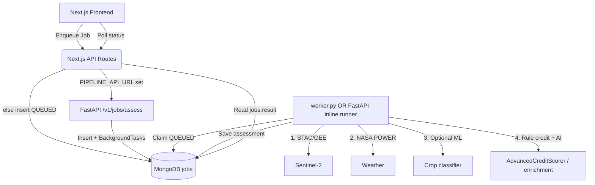

# Agri-Credit Pipeline — Codebase Documentation

Working reference for restructuring and enhancement. Derived from the current source tree (pipeline v4.0), not from the legacy root `codebase.md`.

## Architecture

## Tech stack

| Layer | Stack |
|-------|--------|
| Backend | Python 3.11, FastAPI/uvicorn, Conda geospatial (GDAL/rasterio/geopandas), scikit-learn/XGBoost, Earth Engine / Planetary Computer STAC, NASA POWER, Groq/Sarvam (optional) |
| Frontend | Next.js 16 App Router, React 19, Redux Toolkit, Tailwind CSS v4, MongoDB Node driver, jose/bcryptjs |
| Data | MongoDB (`agristack` default): `farm_info`, `jobs`, `credit_assessments`, `satellite_stats_cache`, webhook collections |
| Deploy | Docker (API only) + Render Blueprint (`render.yaml`); frontend as separate Node service |

## Documentation parts

| Part | Index | One-line role |
|------|-------|----------------|
| **Backend** | [backend/00-overview.md](backend/00-overview.md) · [comparison & enhancements](backend/10-comparison-and-enhancements.md) | Continuous Sentinel-2 → cycles → weather/performance → credit → optional AI; working backlog vs live code |
| **Frontend** | [frontend/00-overview.md](frontend/00-overview.md) | AgriStack sandbox, auth, ingest, dashboard job polling |
| **Deployment** | [deployment/00-overview.md](deployment/00-overview.md) | Local dual-mode jobs, Render/Docker, env/secrets |

**Maintenance:** [enhancement-roadmap.md](maintenance/enhancement-roadmap.md) · [technical-debt-and-cleanup.md](maintenance/technical-debt-and-cleanup.md)

**Legacy snapshot:** [_legacy_codebase.md](_legacy_codebase.md) (archived root `codebase.md`; may be stale).
