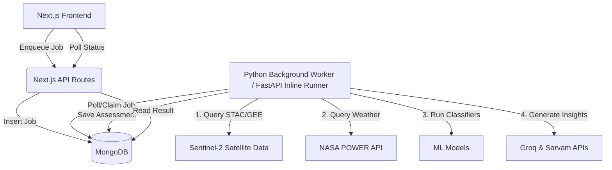

# Agri-Credit Pipeline & Sandbox Codebase Documentation

This document provides a detailed walkthrough of the **Agri-Credit Pipeline & Sandbox** project. It outlines the backend pipeline stages, calculations, methodologies, frontend routing, key functions, dashboard components, and identifies code clutter, dead files, bugs, and security risks.

---

## 1. Architectural Overview

The project is structured as a three-tier system integrating remote sensing, machine learning, and administrative registries:

1. **Backend Pipeline (FastAPI / CLI / Python Background Worker)**: Coordinates satellite data retrieval (STAC/GEE), crop cycle identification, weather risk assessment, yield forecasting, and AI explainability.
2. **Frontend Interface (Next.js App Router / TypeScript)**: Features an administrative portal for querying the **AgriStack Core Sandbox APIs** and an analytical **Assessment Dashboard** to view credit details.
3. **Database (MongoDB)**: Used for storing farmer profiles (`farm_info`), enqueuing tasks (`jobs`), caching satellite observations (`satellite_stats_cache`), and persisting final assessment payloads (`assessments`).



---

## 2. Backend Pipeline Deep-Dive

The pipeline execution flow (orchestrated in [main.py](file:///c:/Users/gopik/Downloads/agri_credit_pipeline/main.py)) runs sequentially through the following steps:

### Stage 1: Geospatial Prep & Snapping
* **Core File**: [satellite_collector.py](file:///c:/Users/gopik/Downloads/agri_credit_pipeline/data_acquisition/satellite_collector.py)
* **Goal**: Define the boundaries and temporal range for the farm field.
* **Mechanism**:
  1. **Geometry Parsing**: The MongoDB GeoJSON field layout or coordinate pairs are converted into a `shapely.geometry.Polygon` object. Centroid and area (hectares) are calculated.
  2. **Boundary Snapping**: To capture 3 full calendar years of agricultural seasons, the start date is snapped back to the nearest seasonal anchor date:
     * **Kharif Anchor**: June 15
     * **Rabi Anchor**: October 15
  3. **Bbox Derivation**: If only a coordinate point is supplied, a bounding box is projected outwards based on the registered field area (minimum buffer: 500 meters).

### Stage 2: Satellite Observation Grid Building
* **Core Files**: [satellite_collector.py](file:///c:/Users/gopik/Downloads/agri_credit_pipeline/data_acquisition/satellite_collector.py), [data_processing.py](file:///c:/Users/gopik/Downloads/agri_credit_pipeline/utils/data_processing.py), [geometry_utils.py](file:///c:/Users/gopik/Downloads/agri_credit_pipeline/utils/geometry_utils.py)
* **Goal**: Build a continuous multi-year, multi-index time-series grid.
* **Calculations & Methods**:
  1. **Temporal Binning**: The snapped time range is divided into uniform 10-day intervals (bins).
  2. **Scene Retrieval**: For each bin, Sentinel-2 L2A STAC items (or GEE ImageCollections) intersecting the field geometry are queried.
  3. **Cloud Filtering**: The scene with the lowest cloud cover is selected. Bins with cloud cover exceeding 60% (stricter in Rabi, more lenient in monsoon Kharif) are skipped, leaving a `NaN` placeholder.
  4. **COG Streaming & Resampling**: Individual band COG (Cloud Optimized GeoTIFF) arrays are streamed in parallel. All bands are resampled to a uniform 10m resolution using bilinear interpolation.
  5. **Vegetation Indices**: For each valid scene, the following indices are computed across the spatial bounds of the farm:
     * **NDVI (Normalized Difference Vegetation Index)**: Measures canopy greenness.
       $$\text{NDVI} = \frac{\text{B08} - \text{B04}}{\text{B08} + \text{B04}}$$
     * **EVI (Enhanced Vegetation Index)**: Corrects for atmospheric noise and soil background signals.
       $$\text{EVI} = 2.5 \times \frac{\text{B08} - \text{B04}}{\text{B08} + 6 \times \text{B04} - 7.5 \times \text{B02} + 1}$$
     * **NDMI (Normalized Difference Moisture Index)**: Gauges canopy water content. Uses B11 (SWIR 1), falling back to B12 (SWIR 2) if B11 is unavailable.
       $$\text{NDMI} = \frac{\text{B08} - \text{B11}}{\text{B08} + \text{B11}}$$
     * **PSRI (Plant Senescence Reflectance Index)**: Evaluates vegetation senescence (harvest readiness).
       $$\text{PSRI} = \frac{\text{B04} - \text{B02}}{\text{B06}}$$
     * **NDRE (Normalized Difference Red Edge)**: Captures chlorophyll levels in mature crops.
       $$\text{NDRE} = \frac{\text{B08} - \text{B05}}{\text{B08} + \text{B05}}$$
     * **NDWI (Normalized Difference Water Index)**: Highlights liquid water molecules.
       $$\text{NDWI} = \frac{\text{B03} - \text{B08}}{\text{B03} + \text{B08}}$$

### Stage 3: Crop Cycle Detection & Land Use
* **Core Files**: [crop_cycle_detector.py](file:///c:/Users/gopik/Downloads/agri_credit_pipeline/crop_analysis/crop_cycle_detector.py), [land_utilization_analyzer.py](file:///c:/Users/gopik/Downloads/agri_credit_pipeline/crop_analysis/land_utilization_analyzer.py), [india_geo_context.py](file:///c:/Users/gopik/Downloads/agri_credit_pipeline/utils/india_geo_context.py)
* **Goal**: Detect individual sowing, peak, and harvest events.
* **Calculations & Methods**:
  1. **Interpolation & Imputation**:
     * **Short Gaps (< 48 days)**: Replaced via linear interpolation between the closest valid grid points.
     * **Long Gaps (≥ 36 days)**: Evaluated using post-gap trends. If the signal is declining after a long gap (senescence), a hat-shaped profile is imputed to preserve the hidden peak. Otherwise, a flat line is used.
  2. **Smoothing**: A Bartlett (triangular) weighted moving average filter of window size 7 is applied to remove residual noise.
  3. **Composite Vegetation Index (CVI)**: Combines greenness, canopy structure, and water signals.
     $$\text{CVI} = 0.5 \times \text{NDVI} + 0.3 \times \text{EVI} + 0.2 \times \text{NDMI}$$
  4. **Peak Finding & Cycle Tracing**:
     * Scans for local maxima in CVI.
     * Walks **backward** from each peak to find the sowing date (CVI dropping below 0.28).
     * Walks **forward** to find the harvest date (CVI dropping below 0.28, or NDVI dropping below 0.36, or reaching a minimum trough).
     * **Multi-pass adaptivity**: If the first pass finds fewer cycles than expected based on the year range, the detector runs a second pass with lower thresholds (prominence down to 58%, peak CVI down to 0.22) to capture cycles suppressed by cloud noise.
  5. **Confidence Rating**: Assigned between 10% and 100% based on peak intensity, cycle duration, standard deviation (temporal variance), and cloud gap penalties.
  6. **Land Utilization Index (LUI)**: The ratio of total cultivated days across all cycles to the total calendar span.
     $$\text{LUI} = \frac{\sum \text{duration\_days}}{\text{total\_calendar\_days}}$$

### Stage 4: Machine Learning Crop Classification
* **Core Files**: [crop_detector.py](file:///c:/Users/gopik/Downloads/agri_credit_pipeline/crop_analysis/crop_detector.py), [config.py](file:///c:/Users/gopik/Downloads/agri_credit_pipeline/config.py)
* **Goal**: Identify the crop species cultivated during each cycle.
* **Calculations & Methods**:
  1. **Feature Extraction**: Slices 15 chronological scenes around the cycle's peak (with a 5-day padding window). Extracts the mean NDVI, EVI, and NDMI from each.
  2. **ML Classification**: Feeds the 45-feature vector into a Random Forest or XGBoost model loaded from `crop_classifier_model.joblib`.
  3. **Registry Override & Hints**: If a crop type or sowing date hint is stored in MongoDB, the classification model adjusts its probabilities toward the target class.
  4. **Path B (Unclassified Fallback)**: If `enable_crop_classification` is `False`, classification is bypassed. Cycle dates remain exact, but the crop name is set to "Unclassified" and credit scoring falls back to a crop-agnostic rule pathway.

### Stage 5: Context-Aware Weather Analysis
* **Core File**: [weather_analyzer.py](file:///c:/Users/gopik/Downloads/agri_credit_pipeline/data_acquisition/weather_analyzer.py)
* **Goal**: Identify weather stressors matching the lifecycle of each crop cycle.
* **Calculations & Methods**:
  1. **Data Sourcing**: Calls the NASA POWER API to fetch daily precipitation (`PRECTOTCORR`), temperatures (`T2M`, `T2M_MAX`, `T2M_MIN`), relative humidity (`RH2M`), and wind speed (`WS2M`).
  2. **Stage Alignment**: Divides each crop cycle into growth stages (Germination/Sowing, Vegetative, Flowering/Grand Growth, Grain Fill, and Senescence/Harvest).
  3. **Extreme Event Detection**:
     * **Heatwave**: Maximum temperature exceeding the 91st percentile (or a floor of 36°C) for at least 3 consecutive days.
     * **Cold Wave**: Minimum temperature falling below the 10th percentile (or a ceiling of 10°C) for at least 3 consecutive days.
     * **Drought**: Fewer than 1.2x the expected daily rainfall percentile, or less than 2mm daily precipitation for 30+ consecutive days.
     * **Heavy Rain**: Single-day precipitation > 100mm, or 3-day cumulative > 200mm.
  4. **Weather Risk Score**: Computed per cycle and aggregated. Penalties are heavily weighted if extreme events occur during sensitive crop stages (e.g., heatwaves during flowering).

### Stage 6: Crop Performance & Yield Evaluation
* **Core File**: [performance_analyzer.py](file:///c:/Users/gopik/Downloads/agri_credit_pipeline/crop_analysis/performance_analyzer.py)
* **Goal**: Measure crop vigor and estimate yield relative to historical baselines.
* **Calculations & Methods**:
  1. **Vigor Evaluation**: Computes the curve fit of actual NDVI against the agronomic growth curves defined in [config.py](file:///c:/Users/gopik/Downloads/agri_credit_pipeline/config.py) for the classified crop type.
  2. **Momentum & Stability**: Evaluates the rate of greenup (growth momentum) and variance during maturity (stability).
  3. **Anomaly Detection**: Flags sudden drops in NDVI, EVI, or NDMI. Drops exceeding $2.0 \times \text{IQR}$ (Interquartile Range) that persist for 4+ scenes are classified as stress anomalies (pest attacks, flash droughts).
  4. **Yield Potential (Cumulative Integral)**: Approximates the biomass and yield potential using the trapezoidal integral of the NDVI curve over the duration of the cycle.
     $$\text{Yield Proxy} = \int_{t_{\text{sow}}}^{t_{\text{harv}}} \text{NDVI}(t) \, dt$$

### Stage 7: Credit Scoring & Limits
* **Core Files**: [credit_scorer.py](file:///c:/Users/gopik/Downloads/agri_credit_pipeline/assessment/credit_scorer.py), [advanced_credit_scorer.py](file:///c:/Users/gopik/Downloads/agri_credit_pipeline/assessment/advanced_credit_scorer.py), [unsupervised_segmentation.py](file:///c:/Users/gopik/Downloads/agri_credit_pipeline/assessment/unsupervised_segmentation.py)
* **Calculations & Methods**:
  1. **Scoring Modes**: Supports `rule_based`, `unsupervised` (KMeans clustering into 5 cohorts + Isolation Forest anomaly detection), `supervised` (XGBoost/Random Forest regressor), and `hybrid` modes.
  2. **Rule-Based Scoring**: A weighted combination of 6 modules:
     * **Crop Detection (35%)**: Pattern presence and confidence.
     * **Crop Performance (30%)**: Vigor, stability, and anomaly penalties.
     * **Yield Potential (15%)**: NDVI integral relative to optimal crop curves.
     * **Cropping Intensity (12%)**: Annual crop cycle frequency.
     * **Weather Risk (5%)**: Deducted score based on extreme weather exposures.
     * **Government Benefits (3%)**: Enrollment in PM-KISAN or PMFBY insurance schemes.
  3. **Credit Limit Recommendation**:
     * Determines a base limit per hectare matching the risk category (Low risk: ₹80,000/ha; Very High risk: ₹15,000/ha).
     * Multiplies the base limit by the field area, cropping intensity factor, crop value multiplier (1.15 for high-value crops like onion/cotton/chilli), and government scheme enrollment bonuses:
       $$\text{Limit} = \text{BaseLimit} \times \text{Area} \times \text{Intensity} \times \text{CropMult} \times \text{BenefitsMult}$$
     * Rounds final limits to the nearest ₹1,000. Interest rates (7% to 15%) and tenure (6, 9, or 12 months) are assigned based on the risk tier.

### Stage 8: AI Enrichment & Explainability
* **Core Files**: [enrichment.py](file:///c:/Users/gopik/Downloads/agri_credit_pipeline/ai_integration/enrichment.py), [shap_explainer.py](file:///c:/Users/gopik/Downloads/agri_credit_pipeline/ai_integration/shap_explainer.py), [counterfactual_engine.py](file:///c:/Users/gopik/Downloads/agri_credit_pipeline/ai_integration/counterfactual_engine.py), [groq_report_generator.py](file:///c:/Users/gopik/Downloads/agri_credit_pipeline/ai_integration/groq_report_generator.py), [sarvam_translator.py](file:///c:/Users/gopik/Downloads/agri_credit_pipeline/ai_integration/sarvam_translator.py)
* **Goal**: Provide transparent explanations and actionable roadmaps.
* **Mechanism**:
  1. **SHAP Feature Attributions**: Computes feature importance for the 19 agronomic features using TreeExplainer (or a rule-based fallback when ML models are disabled).
  2. **Counterfactual Engine**: Identifies which components (e.g., land utilization, stress reductions) can yield the highest credit score gain. Generates 3 actionable scenarios with feasibility scores and timeframes.
  3. **Credit Analyst Narrative**: Queries the Groq API (using the `llama-3.3-70b-versatile` or `llama-3.1-70b-versatile` models) to draft a narrative credit analyst report in English.
  4. **Translation**: Calls the Sarvam AI API (`mayura:v1` translation model) to translate the narrative report into one of 10 Indian regional languages (e.g., Hindi, Telugu, Marathi).

---

## 3. Frontend Application Deep-Dive

The frontend is built using Next.js, Redux Toolkit, and TailwindCSS v4. It consists of the following key directories and files:

### 3.1 Routing Structure
* [app/page.tsx](file:///c:/Users/gopik/Downloads/agri_credit_pipeline/frontend/app/page.tsx): The default root route. Redirects directly to `/agristack` to begin the data collection process.
* [app/login/page.tsx](file:///c:/Users/gopik/Downloads/agri_credit_pipeline/frontend/app/login/page.tsx): Secure login page with standard credential forms. Connects to `/api/login`.
* [app/agristack/page.tsx](file:///c:/Users/gopik/Downloads/agri_credit_pipeline/frontend/app/agristack/page.tsx): Administrative sandbox. Integrates endpoint execution with manual "Save to Platform" options to ingest raw registry records.
* [app/dashboard/page.tsx](file:///c:/Users/gopik/Downloads/agri_credit_pipeline/frontend/app/dashboard/page.tsx): Main dashboard interface. Features a search form to query a farmer ID, loads enqueued jobs, polls for progress, and displays full pipeline reports.

### 3.2 State Management & Stores
* [app/store/index.ts](file:///c:/Users/gopik/Downloads/agri_credit_pipeline/frontend/app/store/index.ts): Configures the Redux store with the token slice.
* [app/store/tokenSlice.ts](file:///c:/Users/gopik/Downloads/agri_credit_pipeline/frontend/app/store/tokenSlice.ts): Manages OAuth access tokens retrieved from the AgriStack Sandbox APIs. Stores the access token, expiration time, and token type.
* [app/hooks/useRedux.ts](file:///c:/Users/gopik/Downloads/agri_credit_pipeline/frontend/app/hooks/useRedux.ts): Typed custom hooks (`useAppDispatch`, `useAppSelector`) to interact with the Redux store.

### 3.3 Integration API Routes
* [app/api/login/route.ts](file:///c:/Users/gopik/Downloads/agri_credit_pipeline/frontend/app/api/login/route.ts): Validates administrative credentials, generates an authentication cookie, and returns a success session payload.
* [app/api/logout/route.ts](file:///c:/Users/gopik/Downloads/agri_credit_pipeline/frontend/app/api/logout/route.ts): Clears cookies and destroys the current user session.
* [app/api/me/route.ts](file:///c:/Users/gopik/Downloads/agri_credit_pipeline/frontend/app/api/me/route.ts): Returns session metadata of the logged-in administrator.
* [app/api/agristack/route.ts](file:///c:/Users/gopik/Downloads/agri_credit_pipeline/frontend/app/api/agristack/route.ts): Handles generic proxied calls to the sandboxed government gateway.
* [app/api/krishi-dss-seek/route.ts](file:///c:/Users/gopik/Downloads/agri_credit_pipeline/frontend/app/api/krishi-dss-seek/route.ts): Proxies requests to the Krishi DSS seeker endpoints.
* [app/api/ingest-farmer/route.ts](file:///c:/Users/gopik/Downloads/agri_credit_pipeline/frontend/app/api/ingest-farmer/route.ts):
  * Recovers raw JSON payloads retrieved from AgriStack.
  * Extracts farmer personal details and land parcels.
  * Clusters agricultural plots using `farmerParcelCluster.ts` to calculate total area, coordinate centroids, and consolidated field geometries.
  * Upserts the structured record into the MongoDB `farm_info` collection.
* [app/api/assess/enqueue/route.ts](file:///c:/Users/gopik/Downloads/agri_credit_pipeline/frontend/app/api/assess/enqueue/route.ts):
  * Receives assessment requests.
  * If `PIPELINE_API_URL` is configured, it forwards the request directly to the FastAPI service (`/v1/jobs/assess`).
  * If `PIPELINE_API_URL` is not configured, it inserts a job document with state `QUEUED` into the MongoDB `jobs` collection to be picked up by `worker.py`.
* [app/api/assess/status/[id]/route.ts](file:///c:/Users/gopik/Downloads/agri_credit_pipeline/frontend/app/api/assess/status/%5Bid%5D/route.ts): Queries the MongoDB `jobs` collection by `jobId` and returns the processing status (`QUEUED`, `RUNNING`, `SUCCESS`, `FAILED`) and result payload.

### 3.4 Client Helpers
* [app/lib/assessmentClient.ts](file:///c:/Users/gopik/Downloads/agri_credit_pipeline/frontend/app/lib/assessmentClient.ts):
  * `runAssessmentJob`: POSTs a farmer ID and overrides to `/api/assess/enqueue`.
  * `pollJobStatus`: GETs the job status from `/api/assess/status/[id]`.
  * `ingestFarmerData`: POSTs the raw JSON structure to `/api/ingest-farmer`.
* [app/lib/farmerParcelCluster.ts](file:///c:/Users/gopik/Downloads/agri_credit_pipeline/frontend/app/lib/farmerParcelCluster.ts): Performs coordinate parsing and spatial clustering on farmer land records. Estimates centroid locations and total field areas in hectares.
* [app/lib/mongodb.ts](file:///c:/Users/gopik/Downloads/agri_credit_pipeline/frontend/app/lib/mongodb.ts): Connects to the MongoDB instance using a cached database client connection to prevent leakages.

### 3.5 Dashboard Components
* [app/dashboard/components/SummaryHero.tsx](file:///c:/Users/gopik/Downloads/agri_credit_pipeline/frontend/app/dashboard/components/SummaryHero.tsx): Renders the primary credit card, credit score dial, approved credit limit, tenure, interest rate, and repayment terms.
* [app/dashboard/components/LocationStrip.tsx](file:///c:/Users/gopik/Downloads/agri_credit_pipeline/frontend/app/dashboard/components/LocationStrip.tsx): Renders geographic details, ecoregion descriptions, centroid coordinates, total farm area, and state/district LGD codes.
* [app/dashboard/components/CroppingSection.tsx](file:///c:/Users/gopik/Downloads/agri_credit_pipeline/frontend/app/dashboard/components/CroppingSection.tsx): Shows dominant crop types, calculated cropping intensity, and chronological crop history.
* [app/dashboard/components/CropCyclesSection.tsx](file:///c:/Users/gopik/Downloads/agri_credit_pipeline/frontend/app/dashboard/components/CropCyclesSection.tsx): Renders individual timeline items for each detected cycle, displaying sowing/harvest dates, peak CVI values, and durations.
* [app/dashboard/components/PerformanceSection.tsx](file:///c:/Users/gopik/Downloads/agri_credit_pipeline/frontend/app/dashboard/components/PerformanceSection.tsx): Renders vigor curves, yield potential percentages, health indexes, stability indices, and flagged anomalies.
* [app/dashboard/components/WeatherSection.tsx](file:///c:/Users/gopik/Downloads/agri_credit_pipeline/frontend/app/dashboard/components/WeatherSection.tsx): Displays temperature, rainfall, and detected extreme weather events (heatwaves, droughts, heavy rainfall) per crop cycle.
* [app/dashboard/components/AIEnrichmentSection.tsx](file:///c:/Users/gopik/Downloads/agri_credit_pipeline/frontend/app/dashboard/components/AIEnrichmentSection.tsx): Renders SHAP feature attributions, counterfactual improvement roadmaps, and the LLM-generated credit analyst report (translated if requested).

---

## 4. Integration & Routing Architecture

The communication between the frontend Next.js server and the Python backend occurs through two patterns:

### Pattern A: MongoDB Job Queue (Worker Mode)
1. **Frontend App**: Enqueues an assessment via POST to `/api/assess/enqueue`.
2. **Next.js Server**: Inserts a job document into the MongoDB `jobs` collection with status `QUEUED`.
3. **Background Worker (`worker.py`)**: Continuously polls the `jobs` collection, locks the next `QUEUED` job (status `RUNNING`), runs the pipeline, writes the result to `result` (or stores errors), and marks the status as `SUCCESS` or `FAILED`.
4. **Frontend App**: Polls `/api/assess/status/[id]` every 3 seconds to fetch the updated job status and display the results.

### Pattern B: Direct FastAPI (Inline Mode)
1. **Frontend App**: Sends a request to `/api/assess/enqueue`.
2. **Next.js Server**: Calls the FastAPI endpoint `PIPELINE_API_URL/v1/jobs/assess`.
3. **FastAPI Server**: Enqueues the job in MongoDB and claims it immediately, running the pipeline inside a background thread pool.
4. **Frontend App**: Polls `/api/assess/status/[id]` to query the MongoDB job status.

### Webhook Integration
When performing AgriStack Sandbox calls (Seek/On-Seek), the frontend coordinates asynchronous webhook responses:
1. When a seek request is made via [agristack/page.tsx](file:///c:/Users/gopik/Downloads/agri_credit_pipeline/frontend/app/agristack/page.tsx), a unique `correlation_id` is generated and sent. The sandbox returns a synchronous acknowledgement (ACK).
2. The sandbox eventually POSTs the actual farmer details asynchronously to one of the webhook endpoints:
   * `/webhook/farmers/on-seek`
   * `/webhook/kdss/on-seek`
   * `/webhook/on-seek`
3. The webhook endpoints save the raw payload to MongoDB (`webhook_responses`, `webhook_farmers_responses`, etc.) keyed by `correlation_id`.
4. The user clicks "Save to Platform" on the frontend, which fetches the webhook payload, clusters the parcels, and writes the farmer record to `farm_info`.

---

## 5. Codebase Maintenance, Dead Code, and Security Risks

Based on a thorough review of the repository, the following files, code blocks, and configuration errors have been identified as candidates for cleanup and optimization:

### 5.1 Commented-Out Legacy Code (High Maintenance Burden)
* **[assessment/credit_scorer.py](file:///c:/Users/gopik/Downloads/agri_credit_pipeline/assessment/credit_scorer.py)**:
  * **Lines 1 to 557** contain the entire deprecated v3.0 `CreditScorer` class commented out with `#`. This adds unnecessary weight to the file.
  * **Clutter**: Duplicate `calculate_credit_limit` signatures exist—one commented out, one active, each with different parameters, causing confusion.
* **[data_acquisition/satellite_collector.py](file:///c:/Users/gopik/Downloads/agri_credit_pipeline/data_acquisition/satellite_collector.py)**:
  * **Lines 1 to 1271** are commented-out legacy implementations of various methods (`collect_historical_data`, `_search_scenes`, `_download_bands`, etc.). Only the code from line 1272 onward is active.

### 5.2 Duplicate Initialization Files
* **[utils/utils_init.py](file:///c:/Users/gopik/Downloads/agri_credit_pipeline/utils/utils_init.py)**:
  * This file is an exact duplicate of [utils/__init__.py](file:///c:/Users/gopik/Downloads/agri_credit_pipeline/utils/__init__.py). It is never imported by any other module and should be deleted.

### 5.3 Critical Runtime Bugs
* **[shap_explainer.py](file:///c:/Users/gopik/Downloads/agri_credit_pipeline/ai_integration/shap_explainer.py) (Line 148)**:
  * A `NameError` occurs when the machine-learning explainability path is executed:
    ```python
    'cropping_intensity_pct': min(100.0, ci * 50.0)
    ```
    The variable `ci` is used here but is never defined. It should be corrected to:
    ```python
    float(ca.get('cropping_intensity', 0))
    ```

### 5.4 Security Risks
* **[api/gee_service_account.json](file:///c:/Users/gopik/Downloads/agri_credit_pipeline/api/gee_service_account.json)**:
  * This file contains hardcoded private keys for the Google Earth Engine service account. Checking service account key files into version control is a major security risk.
  * **Correction**: The key file must be removed from the repository. The application already supports loading credentials through environment variables such as `GEE_SERVICE_ACCOUNT_JSON` or `GEE_SERVICE_ACCOUNT_B64`.

### 5.5 Incomplete Context Implementations
* **[india_geo_context.py](file:///c:/Users/gopik/Downloads/agri_credit_pipeline/utils/india_geo_context.py)**:
  * In the Local Government Directory (LGD) state code lookup helper (`_hint_from_state_lgd`), only code `"9"` (representing Uttar Pradesh) is mapped. The file contains a TODO comment: *"extend as registry stabilises"*. This remains unextended.

### 5.6 Dev/Test/Debug Scripts Cluttering the Root Directory
The root folder is cluttered with temporary scripts and logs created during development. These are not used by the production FastAPI or Next.js pipeline:
* `analyze_real_satellite_data.py`: CLI testing script.
* `check_env_fix.py`: Confirms PROJ/GDAL library setups on Windows conda targets.
* `clean_env.bat` / `install_env.bat`: Batch scripts for package installations.
* `clear_satellite_cache.py`: Maintenance utility to flush the MongoDB satellite cache.
* `debug_crop_cycles.py`: Visualizes and prints debug logs for `CropCycleDetector`.
* `fix_proj.py`: Environment patch utility.
* `installed_packages.txt` / `uninstall.txt`: Flat log files dumping output of pip freeze/conda list.
* `test_crop_cycle_fix.py`: Validation script for crop cycles.
* `test_satellite_fix.py`: Validation script for satellite data downloads.
* `update_env.py`: Script to sync config environments.
* `example_usage.py`: Local CLI usage example. If kept, it should be moved to a `scripts/` or `examples/` directory.
