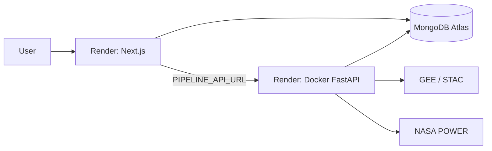

# Deployment — Overview

Hosting is oriented around **Render** (`render.yaml`) with a **Dockerized FastAPI API** and a **separate Node Next.js** service. There is **no GitHub Actions / CI** in the repo today. Locally, assessments run either via FastAPI inline jobs (`PIPELINE_API_URL`) or `python worker.py`.

| Doc | Summary |
|-----|---------|
| [01-environment-configuration.md](01-environment-configuration.md) | Full env inventory (required/optional, where read) |
| [02-containerization-build.md](02-containerization-build.md) | Dockerfile, `.dockerignore`, Conda+pip |
| [03-hosting-infrastructure.md](03-hosting-infrastructure.md) | Render blueprint, local topology, timeouts |
| [04-cicd-pipeline.md](04-cicd-pipeline.md) | **Not implemented** — recommendations |
| [05-monitoring-logging.md](05-monitoring-logging.md) | `/health`, Python logging, gaps |
| [06-secrets-security.md](06-secrets-security.md) | GEE keys, JWT fallback, API keys |

**Stale docs to distrust:** `DEPLOYMENT_AND_FRONTEND.md` (claims Vite frontend, DB default `agricultural_credit_db`, sync-only assess UX). Prefer this folder + `render.yaml` + source.
