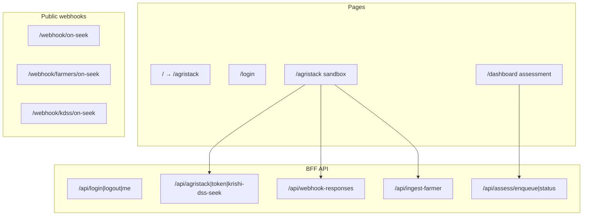

# Frontend — Overview (Updated Deep-Dive)

Next.js **16.1.6** App Router app under `frontend/` (React 19, Redux Toolkit, Tailwind v4, MongoDB driver). Not Vite — older `DEPLOYMENT_AND_FRONTEND.md` is wrong on that point.

## Route / concern map

| Doc | Summary |
|-----|---------|
| [01-routing-pages.md](01-routing-pages.md) | Pages, `layout.tsx`, `proxy.ts` auth gate |
| [02-state-management.md](02-state-management.md) | Redux token slice + AuthProvider |
| [03-api-routes-integration.md](03-api-routes-integration.md) | BFF routes to AgriStack, Mongo, FastAPI |
| [04-client-helpers-utils.md](04-client-helpers-utils.md) | assessmentClient, parcel cluster, jwt, mongodb |
| [05-dashboard-components.md](05-dashboard-components.md) | Report sections + poll UX |
| [06-webhook-integration.md](06-webhook-integration.md) | Seek ACK → async webhook → Save to Platform |

## Local run (from repo README)

1. FastAPI on `:8000`
2. Set `PIPELINE_API_URL` **or** run `worker.py`
3. `cd frontend && npm run dev` on `:3000`
4. Optional `cloudflared` tunnel for AgriStack webhooks

---

## Cross-Stage Themes (What Ties the Whole Frontend Deep-Dive Together)

Having gone through all six frontend docs in detail alongside the nine backend docs, a few threads run across the frontend specifically, and one connects it directly back to the backend review:

### 1. There is one genuinely urgent security item: the hardcoded JWT fallback secret
Stage 04's `jwt.ts` falling back to the literal string `'fallback-secret'` when `AUTH_SECRET`/`NEXTAUTH_SECRET` is unset is the single highest-priority finding across this entire frontend review — higher priority than any UX gap, and comparable in urgency to backend Stage 07's credit-limit-scale question, but of a different nature (this one is a pure security fix with a clear, cheap remedy: fail boot in production if the secret is missing). It should be treated as a "fix before anything else" item, not folded into a general backlog.

### 2. The public webhook surface (Stage 06) is the frontend's most consequential trust boundary
Because `/webhook/*` is deliberately unauthenticated (a real necessity for AgriStack integration) and currently has no signature validation, it's the one place where an external, unauthenticated actor has a plausible path toward influencing what becomes a `farm_info` record — which is to say, a path toward influencing what the entire nine-stage backend pipeline treats as ground truth for a given farmer. This deserves the same "close it now" urgency as the JWT issue, just via a different fix (HMAC/shared-secret validation).

### 3. The frontend's UX gaps mostly trace back to backend caveats not being surfaced, not to independent frontend bugs
"Yield potential" mislabeling (dashboard Stage 05) mirrors backend Stage 06's own flagged concern. The undifferentiated AI-narrative-vs-SHAP display (dashboard Stage 05) mirrors backend Stage 08's governance recommendation. The lack of a farmer picker and opaque polling (Stage 01/05) both stem from the frontend not yet surfacing information the backend pipeline already computes (`pipeline_stages`) or organizational realities the backend already accommodates (Path B being the deliberate default, not a degraded state). This is a genuinely encouraging pattern: most frontend enhancement work here is "surface what the backend already knows or does," not "build new backend capability" — comparatively cheap, high-value work once prioritized.

### 4. Two "same problem, two layers" pairs are worth solving together rather than twice
- **Regional geometry sensitivity:** backend Stage 01's buffer-sizing concern and frontend Stage 04's `farmerParcelCluster` clustering-distance concern are the same underlying "India's parcel geometry varies regionally" issue seen from two different code layers — worth a shared regional-parameters source rather than two independent tuning efforts.
- **Job-consumer guarantees:** backend Stage 09's "jobs can get silently stuck with no consumer" risk and frontend Stage 03's "legacy Mongo-insert enqueue accepts jobs with no confirmed worker" risk are the same failure mode entering from opposite ends of the same pipe — a worker-heartbeat check at intake (frontend) paired with a reaper for stuck jobs (backend) would close this gap from both directions.

## Prioritized Cross-Stage Roadmap (Frontend)

**Do immediately (cheap, high-risk-reduction):**
- Fail boot in production if `AUTH_SECRET`/`NEXTAUTH_SECRET` is unset — remove the `'fallback-secret'` fallback entirely (Stage 04)
- HMAC/shared-secret validation on all three webhook routes (Stage 06)
- Rate limit the enqueue route (Stage 03)
- Surface `pipeline_stages` progress during polling — data already exists (Stages 01/05)

**Do next (moderate effort, compounding value):**
- Searchable farmer picker instead of requiring a known `farmer_id` (Stage 01)
- First-class "Unclassified" UI treatment and reframed "yield proxy" labeling in dashboard components (Stage 05)
- Worker-heartbeat check before accepting legacy-path enqueues (Stage 03, paired with backend Stage 09's reaper)
- Move sandbox/sample credentials out of `config/endpoints.ts` (Stage 03)
- Idempotency keys on farmer ingest (Stage 03)

**Plan for (larger investments, structural improvements):**
- Automated schema validation gate + auto-ingest-on-verified-match for webhooks (Stage 06)
- Shared OpenAPI-derived TypeScript types with FastAPI (Stages 03/04)
- Server-side encrypted AgriStack token persistence (Stage 02)
- Export PDF/report from the slim assessment payload (Stage 05)

---
*This document supersedes the original `00-overview.md` (frontend) with a cross-stage synthesis added on top of the retained route map and local-run instructions. See each numbered stage file for full per-stage detail.*
